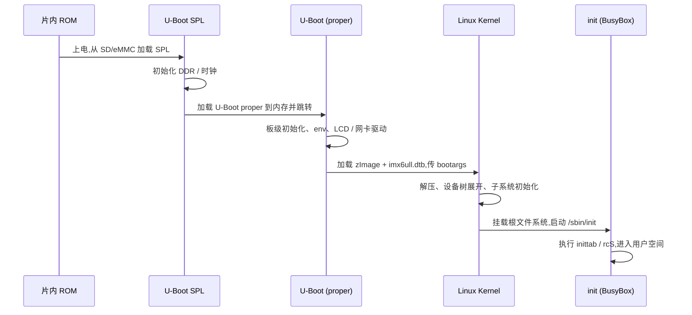

# 阅读体验与排版能力

本页汇总站点内置的阅读体验功能,同时也是这些功能的「活样例」:你可以直接在本页体验字号切换、侧栏拖拽、阅读进度条、长代码折叠,以及 Mermaid 图表渲染。

所有功能由 [`project.config.ts`](https://github.com/Awesome-Embedded-Learning-Studio/imx-forge/blob/main/project.config.ts) 的 `plugins` 与 `readingDefaults` 字段控制,默认值见下表。

## 功能开关一览

| 功能 | 开关字段 | 默认 | 说明 |
|------|----------|------|------|
| 字号切换 / 侧栏拖拽 / 阅读进度条 | `plugins.readingUX` | `true` | 顶栏 A-/A+ 切字号;左右栏边缘可拖拽调宽;顶部 3px 进度条 |
| 长代码折叠 | `plugins.codeFold` | `true` | 超过 `readingDefaults.codeFoldLines`(默认 20 行)的代码块自动折叠 |
| Mermaid 图表 | `plugins.mermaid` | `true` | ` ```mermaid ` 块渲染为 SVG;关闭时退化为普通代码高亮 |

::: tip Mermaid 是打包进站点的,不是 CDN
Mermaid 通过 npm 打包,Vite 把它拆成独立 chunk,**仅在本页真有 mermaid 图时**才按需加载(无图的页面零成本)。它随站点一起部署 —— 离线 / 内网环境照常渲染,不依赖任何外部 CDN。需要关闭时把 `plugins.mermaid` 改为 `false`。
:::

## 字号切换

顶栏右侧有 **A- / A+** 控件(移动端在抽屉菜单里)。共五档:超小 / 小 / 正常 / 大 / 超大,选择会持久化到浏览器,刷新不丢。实现走 CSS `zoom` 整页缩放,等同浏览器原生 Ctrl+/-,正文、侧栏、代码块一起等比变化,不会有「只有正文跳动」的割裂感。

默认档可在 `project.config.ts` 里调:

```ts
readingDefaults: {
  fontTier: 'normal', // 'xxsmall' | 'small' | 'normal' | 'large' | 'xxlarge'
}
```

## 侧栏 / 大纲可拖拽

- **左侧导航树**右边缘有一条隐约的竖线,鼠标按住可拖拽调宽(范围 200–480px)。
- **右侧大纲栏**(桌面端 `≥1280px` 出现)左边缘同样可拖拽(范围 180–360px)。
- 双击手柄即重置为默认宽度。宽度持久化到浏览器,跨页面、跨刷新保留。

默认宽度可调:

```ts
readingDefaults: {
  sidebarWidth: 272, // 左导航默认宽 px
  asideWidth: 256,   // 右大纲默认宽 px
}
```

## 阅读进度条

页面顶部有一条 3px 的品牌色进度条,随滚动百分比推进,长教程页里能一眼看出当前读到哪里。

## 长代码折叠

超过阈值(默认 20 行)的代码块会被自动包成可折叠的 `<details>`,收起时只显示一行 summary,展开后显示完整代码。无 JS 也能展开(原生 `<details>` 语义),打印 / 导出 PDF 时强制全展开。下面这段模拟 `dmesg` 启动日志就是折叠态(超过 20 行):

```text
[    0.000000] Booting Linux on physical CPU 0x0
[    0.000000] Linux version 7.1.0 (mainline) (gcc 15.2 (ARM Toolchain)) #1 SMP
[    0.000000] CPU: ARMv7 processor [410fc075] revision 5 (ARMv7), cr=10c5387d
[    0.000000] CPU: PIPT / VIPT nonaliasing data cache, VIPT aliasing instruction cache
[    0.000000] OF: fdt: Machine model: Freescale i.MX6ULL 14x14 EVK Board
[    0.000000] Memory policy: Data cache writeback
[    0.000000] cma: Reserved 64 MiB at 0x9e800000
[    0.000000] On node 0, zone Normal
[    0.000000] psci: probing for conduit method from DT.
[    0.000000] psci: PSCIv1.1 detected in firmware.
[    0.000000] percpu: Embedded 13 pages/cpu s23756 r8192 d21748 u53248
[    0.000000] Built 1 zonelists, mobility grouping on.  Total pages: 130560
[    0.000000] Kernel command line: console=ttymxc0,115200 root=/dev/mmcblk1p2 rootwait
[    0.000000] Dentry cache hash table entries: 65536 (order: 6, 262144 bytes, linear)
[    0.000000] Inode-cache hash table entries: 32768 (order: 5, 131072 bytes, linear)
[    0.000000] Memory: 488188K/524288K available (8192K kernel code, 728K rwdata, 2848K rodata, 1024K init, 233K bss, 360100K reserved)
[    0.000000] SLUB: HWalign=64, Order=0-3, MinObjects=0, CPUs=1, Nodes=1
[    0.000000] rcu: Hierarchical RCU implementation.
[    0.000000] rcu: RCU calculated value of scheduler-enlistment delay is 10 jiffies.
[    0.000000] NR_IRQS: 16, nr_irqs: 16, preallocated irqs: 16
[    0.000000] clocksource: mxs_timer1: mask: 0xffffffff max_cycles: 0xffffffff, max_idle_ns: 1911260446275 ns
[    0.000014] sched_clock: 32 bits at 3000kHz, resolution 333ns, wraps every 715827882333ns
[    0.000029] Console: colour dummy device 80x30
[    0.000042] Calibrating delay loop... 148.27 BogoMIPS (lpj=741376)
```

阈值可在 `project.config.ts` 调:

```ts
readingDefaults: {
  codeFoldLines: 20, // 改大(如 30)可减少误折叠;改小则更多代码块被折叠
}
```

## Mermaid 图表

嵌入式文档里很多内容天然适合图示:启动流程、设备树层级、驱动调用链、内存布局……站点内置 Mermaid 支持(默认开启),在 Markdown 里写 ` ```mermaid ` 代码块即可。Mermaid 已打包进站点,首次遇到图时自动加载、离线可用。

下面是一个 i.MX6ULL 启动流程的时序图示例,打开本页时它会自动渲染成 SVG:



更多图类型(流程图、类图、状态图、甘特图……)见 [Mermaid 官方文档](https://mermaid.js.org/intro/)。
